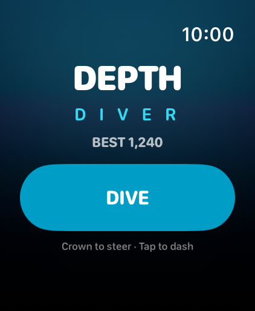
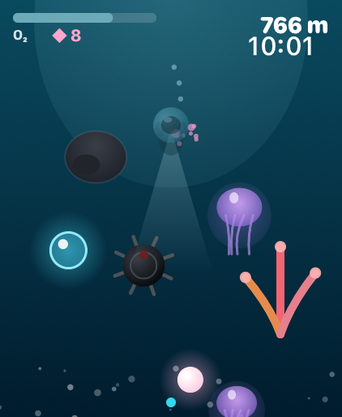
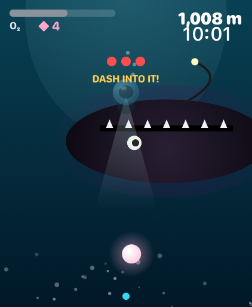
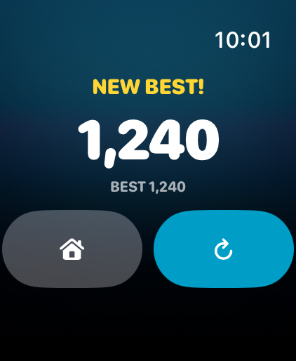

# Depth Diver 🌊

An arcade descent game for **Apple Watch** (built for the Watch Ultra, runs on
watchOS 10+). Steer a diver down an endless ocean trench with the **Digital
Crown**, **tap to dash**, manage your oxygen, dodge the deep, and fight the
anglerfish that ambushes you at every 1000 m.

Written entirely in **SwiftUI** — the whole scene is drawn in a `Canvas`, driven
by a `TimelineView` game loop, with Taptic Engine haptics throughout. No
external art, no SpriteKit, no companion iPhone app required.

## Screenshots

_Captured on the Apple Watch Ultra 3 (49mm) simulator._

| Menu | Gameplay | Boss fight | Game over |
|:----:|:--------:|:----------:|:---------:|
|  |  |  |  |

---

## Controls

| Input | Action |
|-------|--------|
| **Digital Crown** | Steer left / right |
| **Tap screen** | Dash — a downward kick that briefly speeds you up, grants i-frames, and is the **only way to damage a boss** |

## How it plays

- **Descend** forever. Your depth in metres is your score; it climbs faster the
  deeper you get.
- **Oxygen** constantly drains (faster the deeper you are, and while dashing).
  Grab **cyan O₂ bubbles** to refill. Hit **0 = game over**.
- **Hazards** rise toward you: rocks, swaying jellyfish, coral, and spiked sea
  mines. A hit costs a big chunk of oxygen + knocks you back (brief i-frames).
- **Pearls** ◆ are worth bonus points.
- **Boss fight** every 1000 m: an anglerfish blocks the trench. **Dash into it**
  three times to drive it off for a big oxygen + pearl reward. Touch it without
  dashing and it bites you. It retreats after ~16 s either way.
- Difficulty scales continuously with depth: faster scroll, denser hazards,
  nastier enemy mix, and the water darkens so your head-lamp does real work.

Best score is saved between sessions.

---

## Install & run

Requires **Xcode 16+** (developed on Xcode 26.5 / watchOS 26.5 SDK) on a Mac.

```bash
git clone https://github.com/at0m-b0mb/DepthDiver.git
cd DepthDiver
open DepthDiver.xcodeproj
```

### Option A — Run in the Simulator (easiest, no account needed)

1. In Xcode's toolbar, click the run-destination dropdown and pick any
   **Apple Watch** simulator (e.g. *Apple Watch Ultra 3 (49mm)*).
   - No watch simulators listed? Install a runtime via
     **Xcode ▸ Settings ▸ Components ▸ watchOS** (a multi-GB download Apple
     doesn't bundle by default).
2. Press **Run** (⌘R). The simulator boots and the game launches.
3. Steering with the Crown in the Simulator: click the Digital Crown on the
   right edge of the watch, then scroll your mouse wheel / trackpad. Tap the
   screen to dash.

### Option B — Install on your real Apple Watch ⌚️

Your watch must be **paired to your iPhone**, unlocked, and ideally on its
charger. A **free Apple ID works** (the app expires after 7 days and just needs
a re-run from Xcode); a paid **Apple Developer Program** membership removes that
limit.

1. **Add your Apple ID to Xcode:** *Xcode ▸ Settings ▸ Accounts ▸ +* and sign in.
2. **Set the signing team:** select the **DepthDiver** project ▸ the
   **Depth Diver Watch App** target ▸ **Signing & Capabilities** ▸ tick
   *Automatically manage signing* ▸ choose your **Team** (your name / Personal
   Team).
   - If Xcode says the bundle ID is unavailable, change **Bundle Identifier** to
     something unique like `com.yourname.depthdiver`.
3. **Enable Developer Mode on the watch** (watchOS 9+): on the Apple Watch,
   *Settings ▸ Privacy & Security ▸ Developer Mode ▸ On*, then let it restart.
   (The toggle appears after the watch has been connected to Xcode once.)
4. **Pick your watch as the destination** in Xcode's toolbar (it shows up once
   paired; first connection can take a minute over Wi-Fi).
5. Press **Run** (⌘R). Xcode builds, signs, and installs to the watch.
6. **Trust the developer** the first time: on the watch,
   *Settings ▸ General ▸ VPN & Device Management ▸ (your Apple ID) ▸ Trust*,
   then launch **Depth Diver** from the app grid.

> First install to a physical watch can take a few minutes and occasionally
> needs a retry — keep the watch unlocked and nearby.

### Command-line build check

```bash
DEVELOPER_DIR=/Applications/Xcode.app/Contents/Developer \
xcodebuild -project DepthDiver.xcodeproj \
  -scheme "Depth Diver Watch App" \
  -sdk watchsimulator26.5 -destination 'generic/platform=watchOS Simulator' \
  CODE_SIGNING_ALLOWED=NO build
```

---

## Project layout

```
DepthDiver/
├─ DepthDiver.xcodeproj
├─ Screenshots/             # images used in this README
└─ DepthDiverWatchApp/
   ├─ DepthDiverApp.swift     # @main entry, owns the GameEngine
   ├─ ContentView.swift       # phase router (menu / play / game over) + backdrop
   ├─ MenuView.swift          # title screen + best score + DIVE button
   ├─ GamePlayView.swift      # Canvas host: game loop + Crown + tap-to-dash
   ├─ GameOverView.swift      # result screen, replay / home
   ├─ GameEngine.swift        # the whole simulation (movement, spawns, oxygen,
   │                          #   collisions, boss, scoring, persistence)
   ├─ DepthRenderer.swift     # stateless drawing of every frame into the Canvas
   ├─ Models.swift            # entity structs + small math helpers
   ├─ Haptics.swift           # Taptic Engine wrapper (feedback by intent)
   └─ Assets.xcassets         # app icon + accent color
```

## Tuning

Almost every knob lives at the top of **`GameEngine.swift`** (player size,
descent curve, oxygen drain, boss interval) and in `spawnObstacle` /
`obstacleKind` (hazard sizes, depth thresholds for new enemy types). The look —
colours, the diver, creatures, HUD — is all in **`DepthRenderer.swift`**.

> The screenshots above were generated with a small **Debug-only** demo hook in
> `GameEngine.swift` (gated behind the `DD_DEMO` launch environment variable and
> compiled out of Release builds), e.g.
> `SIMCTL_CHILD_DD_DEMO=boss xcrun simctl launch booted com.at0mb0mb.depthdiver`.

## Notes on the Ultra's Action Button

watchOS doesn't expose the Action Button as a general in-game button to
third-party apps, so it isn't a gameplay control here. You *can* assign it to
**launch Depth Diver** from anywhere via *Settings ▸ Action Button ▸ Shortcut*,
which makes for a great one-press "start diving."
